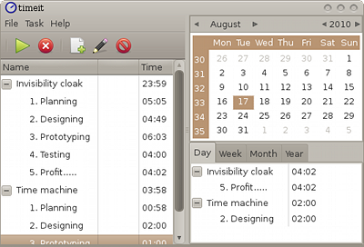

# TimeIT
TimeIT is a time tracker that works quietly almost without any interaction and still measures the time you are spending on multiple projects.  

The concept of this program is that tasks
and projects are assigned to workspaces and while you are in those workspaces your projects are timed.

It features workspace tracking, idle detection, editing of
time records and has summary views grouped by day, week, month,
and year.

For people with multiple computers it will be a nice surprise that it is possible
to run instances on all computers and have the recorded time distributed to them. See [TimeIT-server](https://github.com/Hoglet/TimeIT-Server)

Source is available on [github](https://github.com/Hoglet/TimeIT)

Project homepage is on [github pages](https://hoglet.github.io/TimeIT/)

## Build

### Making debian and redhat packages:
        $ cd Release  
        $ cmake ..  
        $ make package

### Making a debian package the debian way:
        $ debian/rules build  
        $ fakeroot debian/rules binary

## Working environments

TimeIT should work in any X11 environment, theoretically even on Windows (not tested)

Reported to work with following window managers:

* xfwm4 (XFCE)
* compiz (Unity)
* kwin (KDE)
* metacity (Gnome2, Unity)
* mutter (Gnome3)
* muffin (Cinnamon)

