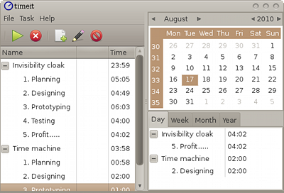

# TimeIT
TimeIT is a time tracker that works quietly with minimal/none interaction while 
registering the time you are spending on multiple projects.  

It features:
* Manual time tracking.
* Automatic time tracking (through workspace tracking). 
* Multiple timers running at the same time. Example "I am at work" and "I work with X"   
* Idle detection.
* Unobtrusive
  * Runs in background.
  * Status Icon in the system tray.
* Distributed database
  * Synchronization with server See: [TimeIT-server](https://github.com/Hoglet/TimeIT-Server)
  * Run on several computers and see the times distributed and visible on all.
* Summary views grouped by day, week, month, and year.
* Show details of a task by day/week/month/year. 
  * When did you work?
  * When did you have a break and for how long?
* Editing of records.

Source is available on [github](https://github.com/Hoglet/TimeIT)

Project homepage is on [github pages](https://hoglet.github.io/TimeIT/)

## Build

### Making a debian package:
        $ debian/rules clean  
        $ debian/rules build  
        $ fakeroot debian/rules binary
deb file will be in parent directory.
Install with gdebi ( or dpkg ).

### Making a redhat package:
        $ mkdir Release
        $ cd Release  
        $ cmake ..  
        $ make package
Install:

        $ rpm -i timeit-<version>.rpm
### Generic
        $ mkdir Release
        $ cd Release
        $ cmake ..
        $ make
Install:

        $ make install

## Working environments

TimeIT should work in any X11 environment, theoretically even on Windows (not tested)

Reported to work with following window managers:

* xfwm4 (XFCE)
* compiz (Unity)
* kwin (KDE)
* metacity (Gnome2, Unity)
* mutter (Gnome3)
* muffin (Cinnamon)

